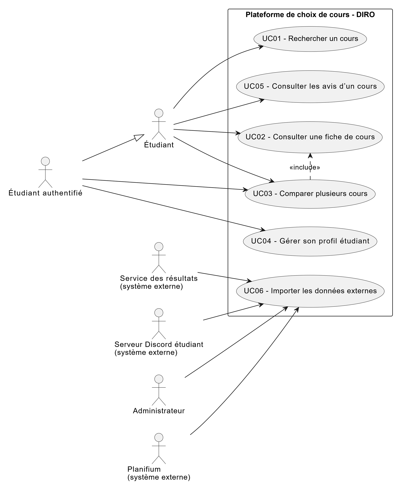

# Cas d'utilisation

## Vue d’ensemble

Ce document décrit les cas d’utilisation principaux du système, leur portée fonctionnelle, les acteurs impliqués, ainsi que les scénarios de réussite et d’échec. Il sert de base pour l’analyse, le design, les tests d’acceptation et la planification.

## Liste des cas d’utilisation

| ID   | Nom                            | Acteurs principaux      | Description                                                                                 |
| ---- | ------------------------------ | ----------------------- | ------------------------------------------------------------------------------------------- |
| CU01 | Rechercher un cours            | Étudiant                | L’étudiant recherche un cours par code, titre ou mot-clé.                                  |
| CU02 | Consulter une fiche de cours   | Étudiant                | L’étudiant consulte les informations détaillées d’un cours.                                |
| CU03 | Comparer plusieurs cours       | Étudiant                | L’étudiant sélectionne plusieurs cours et compare leur charge et leurs horaires.           |
| CU04 | Gérer son profil étudiant      | Étudiant authentifié    | L’étudiant crée ou modifie son profil (préférences et contraintes).                        |
| CU05 | Consulter les avis d’un cours  | Étudiant                | L’étudiant consulte les avis anonymisés donnés par d’autres étudiants sur un cours.        |
| CU06 | Importer les données externes  | Administrateur          | L’administrateur lance ou surveille l’importation des données Planifium et des résultats.  |

---

## Détail

### CU01 – Rechercher un cours

**Acteurs** :  
- Acteur principal : Étudiant (invité ou authentifié)

**Préconditions** :  
- Le système est disponible.  
- Les données de cours sont chargées dans la base (import initial déjà effectué).

**Postconditions** :  
- Une liste de cours correspondant aux critères de recherche est affichée à l’étudiant (ou un message indiquant qu’aucun cours ne correspond).  
- Les critères de recherche saisis peuvent être réutilisés pour une nouvelle recherche (facultatif).

**Déclencheur** :  
- L’étudiant souhaite trouver un cours à partir d’un code (ex. « IFT2015 »), d’un titre ou d’un mot-clé (ex. « programmation », « IA »), et ouvre la page de recherche.

**But** :  
Permettre à l’étudiant de **trouver rapidement des cours pertinents** en fonction de ses intérêts ou de contraintes précises (code, titre, mots-clés), afin de préparer son choix de cours pour une session donnée.

---

#### Scénario principal de réussite (CU01-SP)

1. L’étudiant accède à la page de recherche de cours.
2. Le système affiche un champ de recherche et, éventuellement, quelques filtres simples (par exemple cycle, nombre de crédits, session).
3. L’étudiant saisit un critère de recherche (code, titre ou mot-clé) dans le champ prévu.
4. L’étudiant lance la recherche (par exemple en appuyant sur « Rechercher »).
5. Le système interroge la base de données des cours en utilisant les critères saisis.
6. Le système retourne une liste de cours correspondant à la recherche, triée par pertinence (code exact en premier, puis titres/mots-clés).
7. Le système affiche pour chaque cours un résumé (code, titre, cycle, nombre de crédits, session).
8. L’étudiant parcourt la liste et peut sélectionner un cours pour consulter sa fiche détaillée (transition vers CU02 – Consulter une fiche de cours).

---

#### Scénario alternatif A – Aucun résultat (CU01-SA1)

4A. L’étudiant lance la recherche avec un critère très spécifique ou mal orthographié.  
5A. Le système interroge la base de données mais ne trouve aucun cours correspondant.  
6A. Le système affiche un message du type :  
   - « Aucun cours ne correspond à votre recherche. »  
   - Et propose éventuellement des suggestions (par ex. vérifier l’orthographe ou élargir les mots-clés).  
7A. L’étudiant peut modifier ses critères et relancer la recherche (retour à l’étape 3 du scénario principal).

---

#### Scénario alternatif B – Problème temporaire d’accès aux données (CU01-SA2)

5B. En interrogeant la base, le système rencontre un problème (ex. service de données indisponible).  
6B. Le système consigne l’erreur dans les journaux (log).  
7B. Le système affiche un message d’erreur compréhensible pour l’étudiant (par ex. « La recherche est momentanément indisponible. Veuillez réessayer plus tard. »).  
8B. L’étudiant peut soit réessayer plus tard, soit revenir à la page d’accueil.

---

#### Diamgramme de cas

