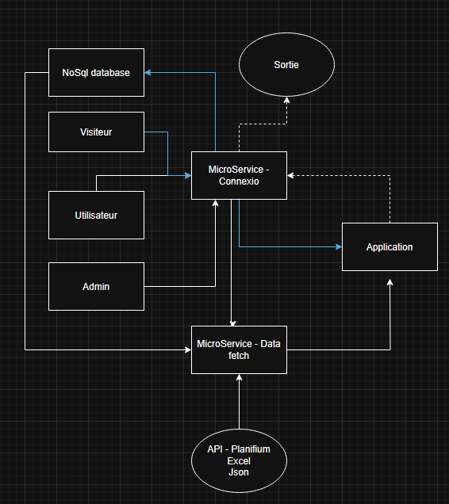
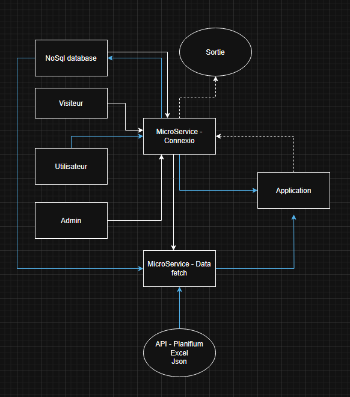
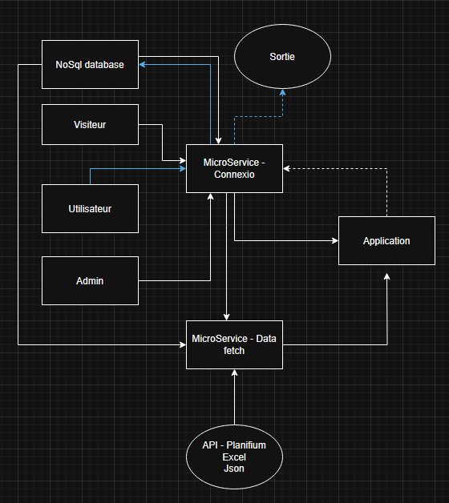
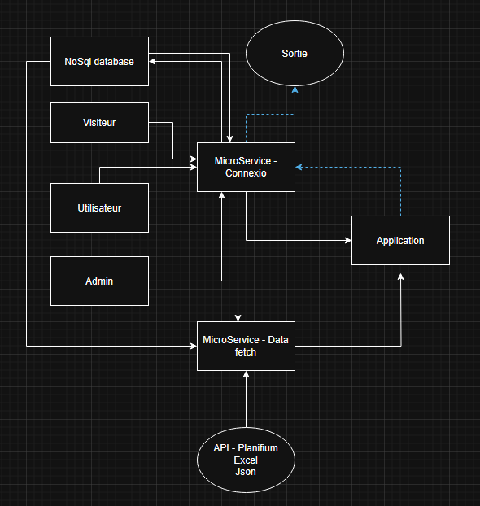
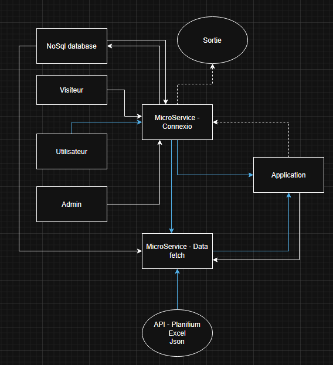
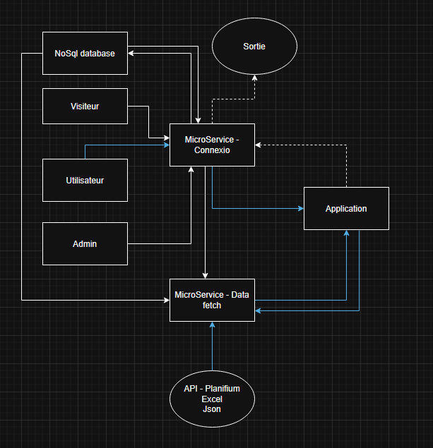

# Flux principaux

## Objectif

Décrire les flux d’interaction entre les acteurs et le système.

## Diagrammes

Inscription

    Visiteur ouvre « S’inscrire ».

    Saisit e-mail, mot de passe, (optionnel) prénom/nom.

    Validations : format e-mail, force du mot de passe.

    AuthService émet un token (JWT/cookie) et redirige vers tableau de bord.

Connexion

    Utilisateur ouvre « Se connecter ».

    Saisit identifiant (e-mail) et mot de passe.

    AuthService compare le hachage, vérifie l’état (active).

    Émission token.

    Redirection vers tableau de bord.

Réinitialiser mot de passe

    Utilisateur clique « Mot de passe oublié ».

    Repondre au question unique.

    Utilisateur ouvre le lien, saisit un nouveau mot de passe (et confirmation).

    AuthService invalide le jeton, met à jour le hachage du mot de passe.

Déconnexion

    Utilisateur clique « Se déconnecter ».

    AuthService marque le token comme revoked.

    Suppression du cookie côté client, redirection vers page publique.

Consulter tableau de bord

    Utilisateur authentifié accède au tableau de bord.

    AuthService vérifie le token/permissions (rôles/scopes).

    API rendu conditionnel selon préférences

Rechercher & filtrer

    Utilisateur ouvre une table avec barre de recherche, filtres, tri, pagination.

    Saisie terme(s) → debounce  → requête SearchAPI.

    Sélection de filtres  → mise à jour des résultats.

    Tri (colonne, ordre) et navigation (page suivante/précédente).

    Affichage résultats paginés + compteur total.
