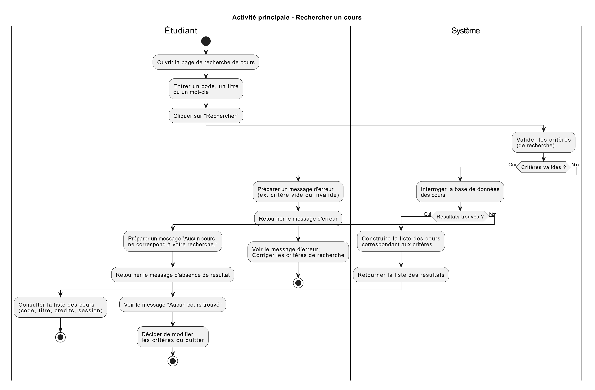

# Flux principaux

## Objectif

Décrire les flux d’interaction principaux entre les acteurs et le système, sous forme de diagramme d’activité UML, afin de clarifier l’enchaînement des actions, les décisions et les scénarios de réussite/échec.

## Flux 1 – Rechercher un cours

### Diagramme d’activité UML

*(Le diagramme montre deux swimlanes : « Étudiant » et « Système ». Les actions de l’étudiant et du système sont ordonnées de gauche à droite, avec des décisions pour les cas d’erreur ou d’absence de résultat.)*

### Description textuelle du flux

**Acteur principal :** Étudiant  
**But :** Trouver rapidement des cours pertinents en fonction d’un code, d’un titre ou de mots-clés.

#### Scénario principal

1. L’étudiant ouvre la page de recherche de cours.  
2. Le système affiche le formulaire de recherche.  
3. L’étudiant saisit un code, un titre ou un mot-clé (par exemple « IFT2015 », « programmation », « IA »).  
4. L’étudiant clique sur le bouton « Rechercher ».  
5. Le système valide les critères de recherche (champ non vide, format minimalement correct).  
6. Le système interroge la base de données des cours avec les critères fournis.  
7. Le système trouve au moins un cours correspondant.  
8. Le système construit la liste des résultats (code, titre, crédits, session, etc.).  
9. Le système affiche la liste des cours à l’écran.  
10. L’étudiant consulte la liste et peut éventuellement sélectionner un cours pour afficher sa fiche détaillée.

#### Scénario alternatif A – Aucun cours correspondant

5A. Les critères sont valides, mais la recherche ne retourne aucun cours.  
6A. Le système affiche un message du type « Aucun cours ne correspond à votre recherche. Veuillez vérifier vos critères ou élargir votre recherche. ».  
7A. L’étudiant peut modifier les critères et relancer une recherche.

#### Scénario alternatif B – Critères invalides

5B. Les critères de recherche sont invalides (par exemple champ vide).  
6B. Le système affiche un message d’erreur expliquant le problème (ex. « Veuillez entrer au moins un critère de recherche. »).  
7B. L’étudiant corrige les critères et relance la recherche.
