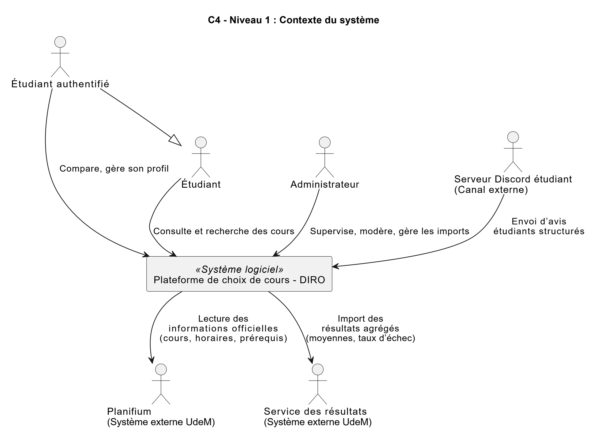
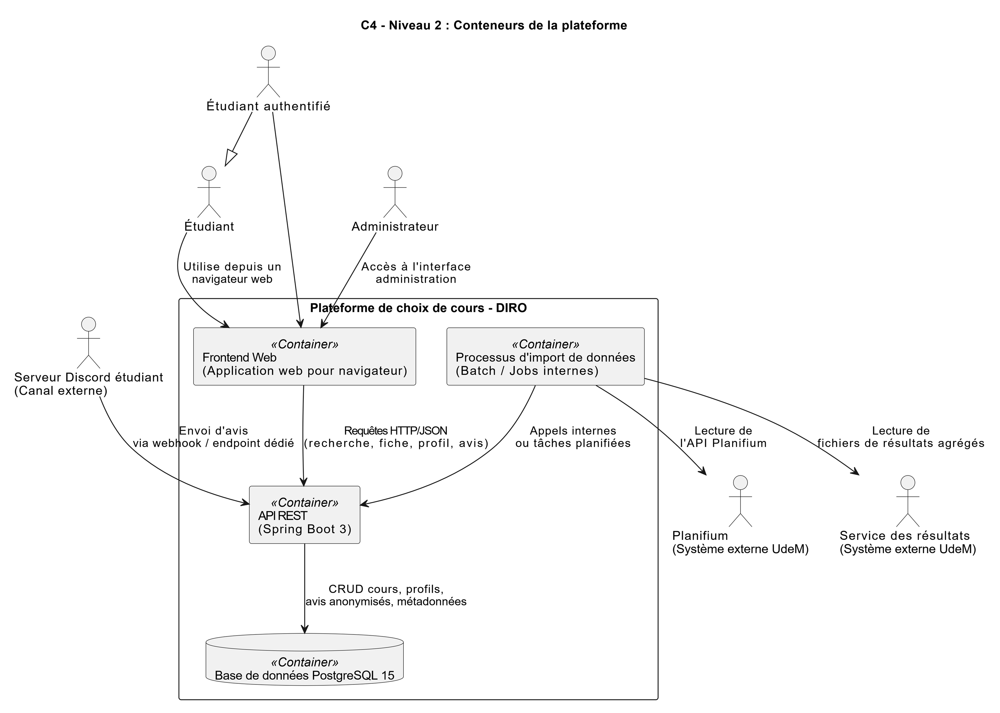
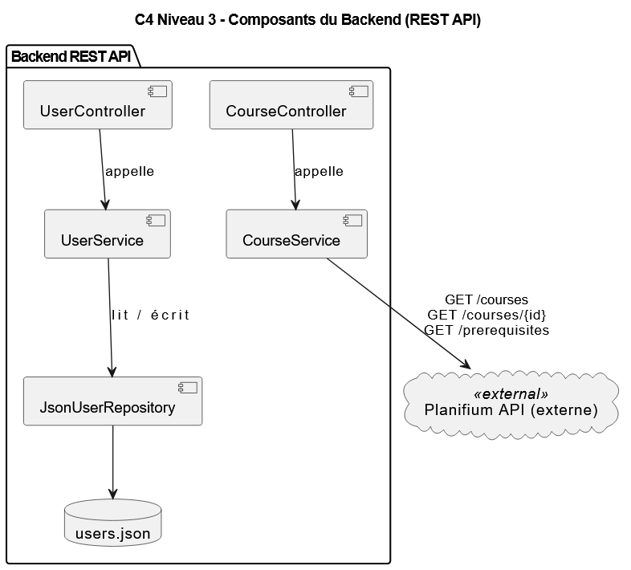

# Architecture du système

## Vue d’ensemble

- **Type** : Application web monolithique exposant une API REST (Backend Java Spring Boot + Frontend web)
- **Contexte** : Plateforme de choix de cours pour les étudiant·e·s de l’UdeM, en priorité ceux du DIRO.
- **Raisons du choix** :
  - Équipe très réduite → limiter la complexité opérationnelle.
  - Mise en place et déploiement rapides (un seul backend, une seule base de données).
  - Cohérence des données (une base unique pour cours, profils et avis).
  - Architecture suffisante pour un projet académique, avec possibilité d’évolution ultérieure.

## Composants principaux

- **Frontend (interface web)**  
  - Application web (ex. React/Vite) accessible via navigateur (desktop et mobile).  
  - Affiche les pages de recherche, fiches de cours, comparaison, gestion du profil.  
  - Appelle l’API backend via HTTP(S) (JSON).

- **API Backend (Spring Boot 3)**  
  - Fournit une API REST pour :
    - Recherche de cours et consultation de fiches détaillées.
    - Comparaison de cours (charge de travail, conflits d’horaire).
    - Gestion des profils étudiants (préférences et contraintes).
    - Consultation et intégration d’avis anonymisés.
    - Lancement et supervision des tâches d’import de données.
  - Services techniques :
    - Validation des requêtes et des données métier.
    - Journalisation (logs) et suivi des erreurs.
    - Tâches planifiées pour l’import périodique des données.

- **Base de données**  
  - **PostgreSQL 15**  
  - Accès via **Spring Data / JPA**.  
  - Stocke :
    - Métadonnées des cours (enrichies à partir de Planifium).
    - Profils étudiants (avec minimisation des données personnelles).
    - Avis anonymisés et statistiques dérivées.
    - Informations sur les imports (traces, dates, sources).

- **Intégrations externes**  
  - **Planifium** : lecture des informations officielles (cours, horaires, préalables).  
  - **Service des résultats** : import des résultats agrégés (moyennes, taux d’échec, etc.).  
  - **Serveur Discord étudiant** : réception d’avis d’étudiant·e·s sous forme structurée (JSON), via un bot ou un webhook.

## Communication entre composants

- **Frontend ↔ Backend** :  
  - Protocole : HTTP(S)  
  - Style : REST/JSON  
  - Exemples : `/courses/search`, `/courses/{code}`, `/profile`, `/reviews`.

- **Backend ↔ Base de données** :  
  - Accès via JPA / Hibernate (JDBC sous-jacent).  
  - Migrations gérées (ex. Flyway ou Liquibase) pour versionner le schéma.

- **Backend ↔ Systèmes externes** :  
  - Planifium : consommation d’une API en lecture seule.  
  - Service des résultats : import de fichiers agrégés fournis (ex. CSV) via un module d’import.  
  - Discord : réception d’appels HTTP (webhook) contenant des avis structurés (JSON).

- **Sécurité (niveau conception)** :
  - Authentification : par exemple JWT ou session serveur (selon le choix de réalisation).  
  - Chiffrement des communications : HTTPS (TLS) entre le frontend et le backend.  
  - Gestion des rôles : au minimum **Étudiant** et **Administrateur** pour restreindre l’accès aux fonctionnalités sensibles (imports, modération).

## Flux techniques clés

- **Recherche de cours** :  
  - Frontend appelle l’API `/courses/search` avec les critères (code, titre, mots-clés, filtres).  
  - Le backend interroge la base, applique la pagination/tri, renvoie une liste de résultats.  

- **Consultation d’une fiche de cours** :  
  - Frontend appelle `/courses/{code}`.  
  - Le backend assemble les informations : métadonnées, statistiques agrégées, avis anonymisés.

- **Comparaison de cours** :  
  - Frontend envoie une liste de codes de cours à l’API.  
  - Le backend calcule la charge totale estimée, détecte les conflits d’horaire, et renvoie un résumé comparatif.

- **Import des données externes** :  
  - Un administrateur ou une tâche planifiée déclenche un import.  
  - Le backend appelle Planifium et lit les fichiers de résultats.  
  - Les données sont validées, transformées et persistées dans PostgreSQL.

- **Gestion des erreurs** :  
  - Codes HTTP explicites (400, 401, 403, 404, 409, 500).  
  - Corps de réponse JSON avec un message clair et un code d’erreur applicatif.  
  - Journalisation des erreurs côté serveur.

## Déploiement

- **Environnement cible** : serveur Ubuntu 22.04.  
- **Empaquetage** :
  - Backend Spring Boot en image Docker.  
  - Frontend web servi soit par un serveur statique (Nginx), soit via le backend.  
  - Base PostgreSQL : conteneur Docker ou service managé (selon le contexte).

- **Réseau** :
  - Frontend → Backend via HTTPS.  
  - Backend → PostgreSQL via réseau interne sécurisé.  
  - Backend → Planifium / Service des résultats / Discord via Internet (sortant).

- **CI/CD (optionnel)** :
  - Pipeline automatisé pour : build, tests, analyse statique, génération d’images Docker, déploiement.

- **Sauvegardes** :
  - Sauvegardes régulières de la base PostgreSQL (dumps, snapshots).  
  - Versionnement des scripts/migrations de base de données.

## Performance & Scalabilité

- Index sur les colonnes fréquemment filtrées ou triées (code de cours, titre, session, etc.).  
- Cache léger pour certaines listes relativement stables (ex. liste des cours d’une session).  
- Possibilité de scaler horizontalement le backend (plusieurs instances derrière un reverse proxy) si la charge augmente.

---

## Diagramme d’architecture (Modèle C4)

### Niveau 1 – Contexte du système

Ce diagramme montre la plateforme de choix de cours au centre, entourée :
- des **acteurs humains** (Étudiant, Étudiant authentifié, Administrateur) ;
- des **systèmes externes** (Planifium, Service des résultats, Serveur Discord étudiant).  
Il illustre qui interagit avec le système et dans quel but (consulter, comparer, importer, fournir des avis).

### Niveau 2 – Conteneurs

Ce diagramme détaille les **conteneurs** internes de la plateforme :
- **Frontend Web** : application utilisée par les étudiant·e·s et l’administrateur.  
- **API REST Spring Boot** : cœur applicatif qui implémente les cas d’utilisation métier.  
- **Processus d’import de données** : module chargé de communiquer avec Planifium, le Service des résultats, et de traiter les avis Discord.  
- **Base de données PostgreSQL** : persistance des cours, profils, avis et métadonnées d’import.  

Il montre aussi les liens de communication entre ces conteneurs et les systèmes externes.

### Niveau 3 – Composants de l’API REST

Ce diagramme zoome sur le conteneur **API REST** et présente les **composants internes** :
- **Contrôleurs REST** (CourseController, ProfileController, ReviewController, AdminImportController).  
- **Services métier** (CourseSearchService, CourseDetailsService, ProfileService, ReviewService, ImportService).  
- **Adaptateurs externes** (PlanifiumAdapter, ResultatsAdapter, DiscordReviewAdapter) pour isoler les appels aux systèmes externes.  
- **Repositories** Spring Data (CourseRepository, ProfileRepository, ReviewRepository) qui accèdent à PostgreSQL.

Ce niveau montre comment l’API est structurée pour séparer les responsabilités, faciliter les tests et permettre l’évolution future de l’architecture.
